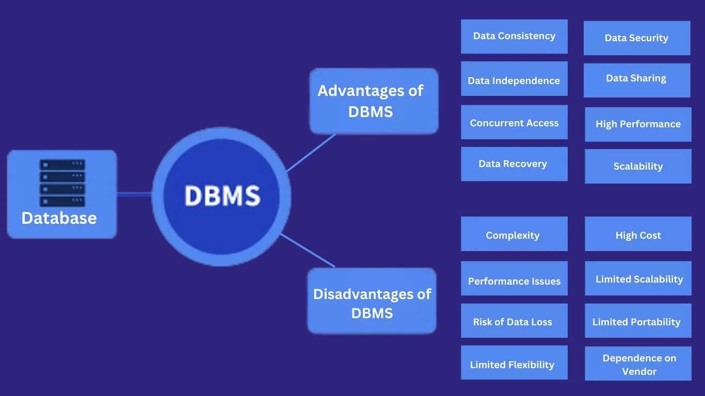
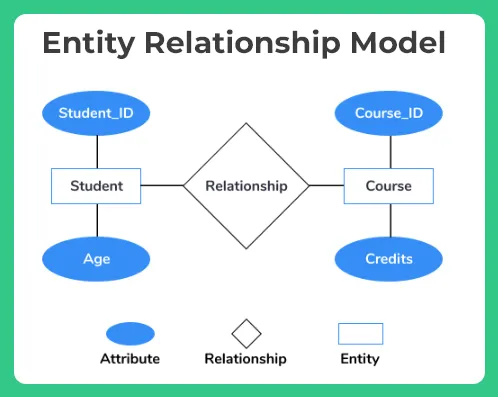
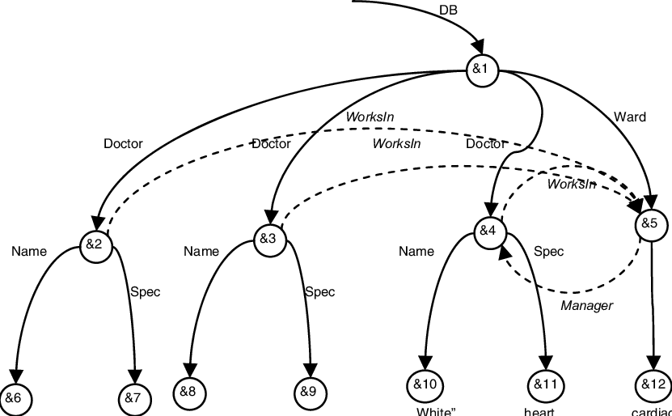
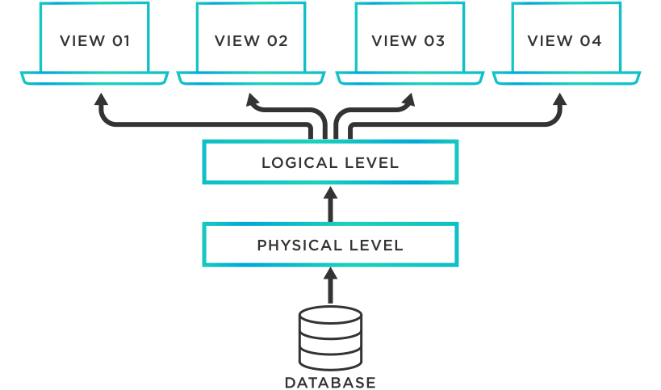
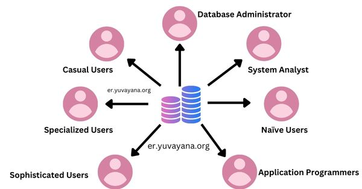

### Topic : Database Systems Fundamentals
### Lesson 1:
**Key Points  from the Unit**
-- **Databases**: Organized collections of electronically stored data.  
- **Database Management System (DBMS)**: Software that allows efficient data storage, retrieval, and manipulation.  
- **Advantages of DBMS**:  
  - Ensures data consistency  
  - Scalable and secure  
  - Reduces redundancy  
  - Improves data organization  
- **Disadvantages of File-Processing Systems**:  
  - Data redundancy  
  - Difficult data retrieval  
  - Integrity issues  
  - Security risks  
- **Importance of DBMS**:  
  - Used in banking, social media, healthcare, navigation, etc.  
  - Can improve efficiency, security, and accessibility in Bhutan’s public sector.

**My Learning and Importance**
- Learning Database Systems is Important: 
Data has now become the most important asset in the world where digital is prevailing. The study of databases provides a good grounding onto modern database management systems from inefficient file-based systems.

- Core Benefits of Databases: 
Applications become **trustworthy, accessible, and secure** for all users. They increase the efficiency and reliability of real-world systems.

**Personal Growth and Reflection**
- **What I Learned**:  
  - Improved **critical thinking and problem-solving** about how databases help manage data better.  
  - Learned how database systems make applications more **efficient**.  

- **Why It Matters**:  
  - Organizing data properly improves **productivity, decision-making, and services**.  

### Lesson 2:
Lessons in the database systems fundamentals include the following:

**1. Understanding Data Models**

- The data models define the shape and form in which data resides in a database.
- The four main data models cover:
   1. Entity-Relationship Model 

   

   2. Semi-Structured Data Model

   

   3. Object-Based Data Model

   

   4. Relational Model

   
   
   
- This entails the designing of efficient databases that allow specification of appropriate use.

**2. Database Languages and Their Applications** 
- SQL (Structured Query Language) is a basis on which database is established and interacted with.
- Two major groups of these languages are:
  - DDL(Data Definition Language): Defines schema and constraints.
  - DML (Data Manipulation Language): Accesses, inserts, deletes, or updates the data.
- SQL supports both data manipulation approaches, declarative and procedural.

**3. Database Architecture and Components** 
- The multi-layered abstraction system of database architecture includes:
  - **Physical Level**: How data is stored.
  - **Logical Level**: What data is stored and how it relates to each other.
  - **View Level**: Defined simplified view of the database to users.

  

- It is composed of the following components: 
  - Storage Manager
  - Query Processor
  - Transaction Management
- Each of these elements gives a critical foundation to the efficient management and optimization of databases.

**4. Types of Database Users and Roles** 
- Database Users:
  - **End Users**: Users who invoke applications to get data or update it.
  - **Application Developers**: Application development for the database to be utilized.
  - **Database Administrators (DBAs)**: tasked with maintenance of integrity, security, and performance of the database.
  - **System Analysts and System Designers**: defines the database structure and functionalities.
- The DBA works towards ensuring that the database system runs appropriately.

**5. Importance of Database Design** 
- Database design process includes blueprinting:
  1. Suitable data model selection.
  2. Conceptual design to pin down on functional requirements.
  3. Logical design-for schema mapping to a database system.
  4. Physical design-for storage and performance aspects.
- An efficient database gets rid of redundancy in designing a designed database and thus improves data integrity.

---

**What I Learned**  
-- Learning different **data models** helps design efficient data storage and management systems.  
- **SQL** is essential for querying data, a key skill in software development and analytics.  
- Understanding **database architecture** and **user roles** ensures secure and effective database administration.  
**Reasons that make this important**-  
Understanding database architecture and user roles is necessary for managing databases and thus their security.

---

**Personal Growth and Reflection**  
- Improved my **analytical thinking** by learning how to organize data for easy retrieval.  
