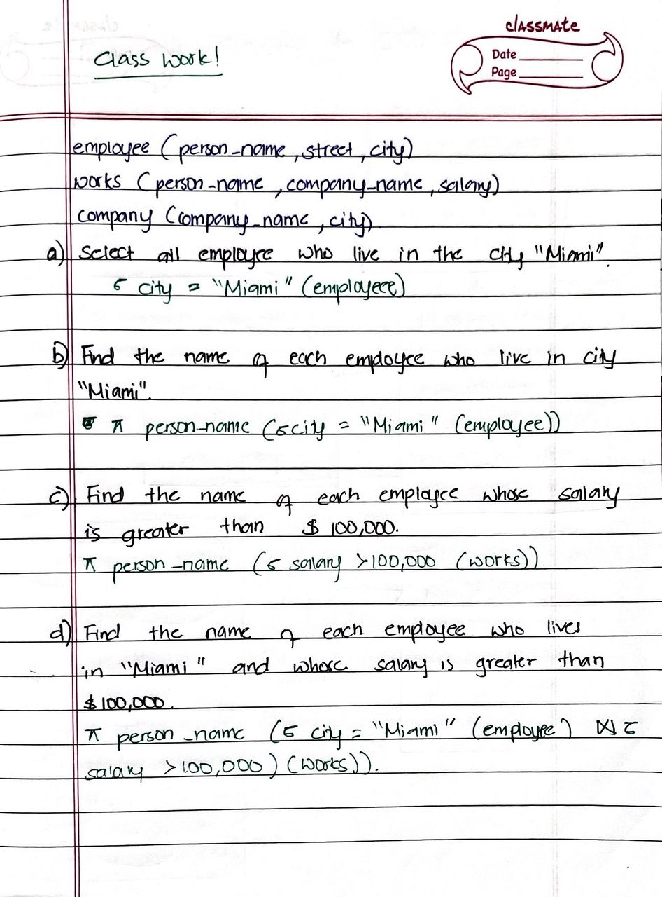

# UNIT 2
## My Journey Through Relational Algebra, ERDs, and SQL 🚀💻
Data structuring and interrelation concepts are necessary to build efficient and scalable systems in databases. In this unit , topics that highlight the basic principles of constructing organized databases are , Entity-Relationship Diagrams (ERDs), Relational Models and Schema Design, ERD to Relational Schema Translation, and Relational Algebra.

#### KEY TAKEAWAYS FROM THE UNIT:
I'm about to take you on a journey through my key takeaways from this unit.

*Spoiler alert:* It's not only about tables and rows; it's really about the corporate spine of every application, website, and system that you check in on once a day. Come on, let's do this! 🚀

## What I learned and why it matters 🧠💡
1. **Relational Algebra:** The Math Behind the Magic
What I know: Relational algebra is sort of like the secret sauce behind SQL. It's a bunch of operations (like SELECT, PROJECT, UNION, JOIN, etc.) that help us manipulate data in a structured way. Think of it as the "math" of databases.

- **Why It Matters:** Without relational algebra, we wouldn't have SQL. And without SQL, we'd be flat out crawling through spreadsheets like cavemen. 🦕

If **Relational Algebra** were a human figure, then it would be the one friend who organizes things effectively. So if you were trying to find all the red T-shirts in a disorganized closet, this friend would say, **"No worries! I’ll SELECT only the red ones and PROJECT just the T-shirts for you!"** 🎯👕

2. **ERDs:** Drawing the Blueprint of Data
**What I Learned:** Entity-Relationship Diagrams are like blueprints that define how things such as students, courses, and instructors fit into an architectural floor plan of a database.

**Why It Matters:** ERD is the base of all good designs. Your database might end up looking like a spaghetti monster 🍝; messy and impossible to traverse, if there are not any.

3. **Relational Schema:** Bringing Ideas to Reality
**What I've Learned:** A relational schema is the manifestation of an entity-relationship diagram. This is the part where we define tables and primary, foreign keys, as well as relations.

**Why It Matters:** This is a place where the rubber meets the road. A well-designed schema keeps your database in good running order and doesn't die a crashing death when you try to query it.

**Funny Thought:** It would be a cooking Ema Datsi if relational schemas were. Primary key would be the real major ingredient like chilli,cheese, and foreign key would be the oil,salt tying everything together. 🍳✨

4. **SQL:**  The Language of Databases
**What I Learned:**  SQL is the language to talk to databases. So if you want to ask something like "Give me all the students who didn't pass Database Systems", you must send it over in this language (ouch ..hoho😬). 

**Why It Matters:** SQL is embedded everywhere. All these apps- Instagram to tiktok- are at some backend given the SQL instructions to get data in and out.

**Funny Thought:** If SQL were a human, it would be that one friend who knows everything at all times. "Hey SQL, what's the meaning of life?" "SELECT * FROM universe WHERE meaning = 'life';" 🤖

---
Personal Growth and Reflection 🌱💭 
---
### Pre-knowledge: the struggle was real😵‍💫 
Before this unit, what I knew about databases could be summed up into "eye" and "squint" because it wasn't too bright. I could see and know what a table looks like, and I could construct a semi-complex SQL query; that was about it.  😅 

But now? I feel like a better🥲. I can design an ERD, translate it to a relational schema, and write SQL queries that would bring tears of joy to the me from the past. I've improved so much in a short time; it's unreal. The joy after running the queries is another level of  happiness😇

**The Challenge 💪:**
Definitely not a bed of roses, because there were times when I have stared at a  query for hours, and then asked myself why it was not returning the expected results.Every time I tried to copy the lines from the link provided by ma'am, they appeared differently in the SQL shell. It was so frustrating that I had to quit and restart the SQL shell each time. 😖 

But you know, those challenges made the victories even sweeter. Every time I managed to work my way through a query or design a schema that actually made sense, I felt like I had climbed Mount Everest. 🏔️😎

---
Task Done in the class:

---
### Task 1:
Draw an entity relationship diagram for the student
registration system at CST.

### Task 2: Transforming the given ERD to Relational Schema

### Task 3: 
