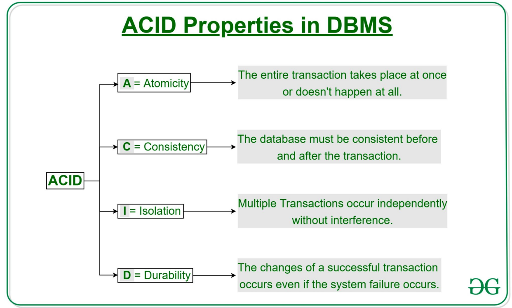

**My Odyssey of ACID Properties, SQL Wizardry, and Database Advanced Technologies 🚀💻**  
Databases remain these unsung heroes, ever-present, behind every app my heart so dearly loves. In a way, this unit took me from a clumsy beginner in databases to a suave SQL speaker and design thinker for strong systems. To set the stage, let's wade through ACID, nested subqueries, and the artistry of making sure that data stays consistent-no spreadsheet-toting cavemen here!

---

### **KEY TAKEAWAYS FROM THE UNIT**  
It was not really about memorizing syntax but more about understanding the *why* of databases.
 **Spoiler alert:** It's all about structure, reliability, and interrogating your data with the right questions.  

---

### **My Learning and Its Importance 🧠💡**  

#### **1. ACID Properties: The Watchdogs of Data Integrity**  

**What I Learned:**  
ACID (Atomicity, Consistency, Isolation, Durability)-the super-heroes of the data world-were forever keeping the database dependable. Atomicity means the whole transaction had to occur; no in-between, like transferring money without actually losing grip on it. Consistency is what keeps your data from turning into gibberish, Isolation ensures that transactions do not step on each others' toes, while Durability guarantees data is not wiped off the earth in case of a crash.  

**Why It Matters:**  
Without ACID: Bye-bye, bank balance, after any app crash. 
With ACID: Hello, safe data, while your laptop rides three hundred feet of air as a frisbee. 💸🛡️  

**Funny Thought:**  
If ACID were a band, Atomicity would be on drums (keeping the beat), Consistency would be singing (keeping pitch), Isolation would be on guitar (soloing with a noise-canceling performance), and Durability would be the bassist (always present through the encore). 🎸  

---

#### **2. SQL: From Baby Steps to Ninja Moves**  
**What I Learned:**  
- **Basics:** `CREATE TABLE`, `INSERT`, `SELECT * FROM chaos;`  
- **Filtering:** `WHERE`, `AND/OR`, `LIKE` (hello, wildcards: `%` = "I’ll take anything!").  
- **Joins:** Combining tables like a data DJ.  
- **Advanced:** Nested subqueries (that is, queries inside queries-Inception style), aggregate functions (`SUM()`, `AVG()`), and `GROUP BY` for squad huddles.  

**Why It Matters:**  
SQL is the language of databases. Want to find all users named "Dorji" who bought a ticket to LA? SQL translates your chaos into structured answers. 

**Funny Thought:**  
If SQL were a chef, `WHERE` would be the knife (slicing data), `JOIN` the blender (mixing tables), and `GROUP BY` the sous chef (organizing ingredients). 🍳🗡️  

---

#### **3. NULL Values: The Drama Queens of SQL**  
**What I Learned:**  
NULLs are *unknown*—not zero, not empty. Arithmetic with NULL? Result is NULL. Comparisons? *Unknown*. Use `IS NULL` or face eternal confusion.  

**Why It Matters:**  
Forget handling NULLs, and your calculations might ghost you. Example: `5 + NULL = NULL`—poof, your budget report just vanished. 👻  

**Funny Thought:**  
NULL is like that friend who says, “I’ll maybe come to your party.” You can’t count on them, but you can’t ignore them either.  

---

#### **4. Aggregates and Grouping: Data's Group Therapy**  
**What I Learned:**  
- `AVG()`, `MIN()`, `MAX()`, `COUNT()`: The Fab Four of summarizing data.  
- `GROUP BY` + `HAVING`: Like a bouncer filtering rowdy groups.  

**Why It Matters:**  
Need to find the average salary per department? `GROUP BY` is your therapist, organizing your data into meaningful clusters.  

**Funny Thought:**  
`GROUP BY` is sorting LEGOs by color, then with `HAVING`, you get rid of that neon green nobody likes. 🧱✨  

---

#### **5. Nested Subqueries and Set Operations: SQL Inception**  

**What I Learned:**  
Subqueries within `WHERE`, `FROM`, even `SELECT`! `IN`, `EXISTS`, `ANY/ALL` for set comparisons.  

**Why It Matters:**  
Want flights booked by users who *also* canceled a ticket? Nested queries dig deep without breaking a sweat.  

**Funny Thought:**  
Nested subqueries are like Russian dolls—each layer reveals a smaller, more specific answer. 🪆  

---

### **Personal Growth and Reflection 🌱💭**  
**Pre-Knowledge Struggles:**  
I always believed that `JOIN` was a yoga position. Now? I can `LEFT JOIN` tables with my eyes closed (figuratively). Writing a nested query was like a Rubik's cube puzzle till it unlocked!  

**Victories:**  
- Developed a relational schema for an airline system with tables: Users, Flight, Ticket.  
- Wrote a query with GROUP BY and HAVING clauses to find departments with avg salary > $42k. 💰  
- Survived 'NULL' apocalypse using COALESCE().  

**Challenges:**  
- **NULLs:** Forgetting IS NULL resulted in ghost results.  
- **Subqueries:** Accidentally made infinite loops (oops).  
- **PostgreSQL Syntax:** Why does BIT type hate me? 😤  

---

### **Tasks Done in Class**  
1. **The ACID Property Discussion:** Discuss whether "Consistency" or "Durability" counts more (team Durability for the win!).  
2. **ERD to Relational Schema:** Created foreign keys by the table from an ERD for an airline-no spag monster here!  
3. **Tough Query:** `EXISTS` and `NOT IN` were used to retrieve the users who booked a flight but didn't cancel.  

---

### **UNIT END Thoughts**  
Databases are the uncelebrated troops at technology's back. I learnt this unit to speak this language fluently. Next, it's joins and transactions! 🚂  

**Funny Closing:**  
If databases were a movie, ACID would be the plot armor, SQL would be the script, and NULL values would be the plot twists nobody saw coming! 🎬  

---  
