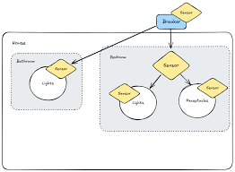
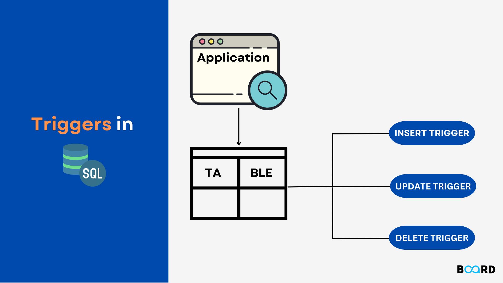
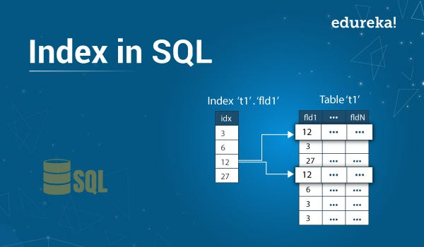

**My Journey Through Recursive Queries, SQL Sorcery, and Database Guardianship 🧙♂️📊**  
The lessons concerning paving the ways through recursive CTE along with making triggers perform the duty of overzealous security laid the ground for having transformed me into a SQL learner. Let's enter the magic of hierarchical data, the theater for authorization and the art of making databases *sing* with programming languages.  

---

### **TAKE AWAYS FROM THE UNIT**  
This unit was more than just knowing the syntax-it was learning how to **think recursively**, store the data as **securely as Fort Knox**, or even integrate SQL into the wild world of programming.  

---

### **My Learning and Its Importance 🧠💡**  

#### **1. Recursive Queries: SQL's Family Genealogy Explorer**  


**What I Learned:**  
Recursive Common Table Expressions refer to SQL queries having references to themselves, which tends to be important in hierarchical data such as those modeled through an organizational chart or product categories. Example: put-all subordinates under this manager, transitive closure assessment, etc.  
```sql  
WITH RECURSIVE Subordinates AS (  
    SELECT employee_id FROM employees WHERE manager_id = 101  
    UNION ALL  
    SELECT e.employee_id FROM employees e  
    INNER JOIN Subordinates s ON e.manager_id = s.employee_id  
)  
SELECT * FROM Subordinates;  
```  

**Why This Is Important:**  
Without recursion, querying multi-level hierarchies had to be done in infinite loops or through the use of external scripting. With CTEs? One very classy rue.  

**Funny Thought:**  
Recursive CTEs are like a command demanding that a robot keep cloning itself until it shouts, "I'm out of clones!" 🤖➰  

---

#### **2. Functions & Procedures: The Business Logic Chefs**  
**What I Learned:**  
- **Functions** return a value and can be used in `SELECT` statements.  
- **Procedures** execute some action (for example: inserting data) and are called with a `CALL`.  
Example: A function for fetching the appointments of a patient and a procedure for scheduling them while checking doctor availability.  

**Why This Matters:**  
Encapsulating logic in functions/procedures reduces code duplicity. How often do you calculate taxes? Call it once, and reuse it forever.  

**Funny Thought:** Functions are like microwave meals (quick, single-purpose), whereas procedures are like cooking shows (multiple steps, drama included). 🍲🎬  

#### **3. Triggers: An Alarm System That Works Overtime for the Database** 
 
**Takeaways:**  
Triggers execute SQL code automatically in response to events such as INSERT, UPDATE, or DELETE. For instance, it alerts the user when a prescription is added.  
```sql  
CREATE TRIGGER NewPrescriptionAlert  
AFTER INSERT ON Prescription  
FOR EACH ROW  
EXECUTE FUNCTION notify_new_prescription();  
```  

**A Note on Its Importance:**  
Triggers apply complex business rules uprooting the need for an external application; no prescription, no alert!  

**An Amusing Thought:**  
Triggers are that friend who calls you the moment you purchase, “DID YOU JUST BUY MORE CAT FOOD?” 🐱📱  

---

#### **4. Indexes: The Librarians of Data** 
 
**What I Learned:**  
Indexes speed up the grabbing of data by generating paths for the queries. `CREATE INDEX`, then make sure to avoid full table scans.  
```sql  
CREATE INDEX dept_index ON instructor (deptname);  
```  

***Why It Matters***  
Without indexes, searching a database is like looking for a needle in a haystack... while blindfolded. 🔍  

**Funny Thought:**  
Indexes are the Dewey Decimal System for databases—without them, librarians (queries) panic. 📚😱  

#### **5. Authorization: The Bouncer at the Data Club**  
**What I Learned:**  
- With **GRANT** privileges (like SELECT, INSERT, etc.) are assigned.  
- It is **REVOKE** that takes it away.  
- Roles encompass permission, e.g., with `CREATE ROLE admin;`.  

**Why It Matters:**  
Without authorization, your database is a free buffet for hackers. 🍣🔓  

**Funny Thought:**  
Authorization is rather like the bouncer checking membership cards before entry into the club. "Sorry, `PUBLIC`, you're not on the list." 🎟️🚫  

---

#### **6. Accessing SQL from Programming Languages: Bridging Worlds**  
**What I Learned:**  
- Connect JDBC/ODBC Java/C# to Databases.  
- The Dynamic SQL constructs queries at runtime (for example, filters created by a user).  

**Why It Matters:**  
If you want a python application to import data, you can use SQL plus programming languages to get most of your work done.  

**Funny Thought:**  
It's teaching SQL to talk Python—initially awkward, but eventually best friends. 🐍🤝🗄️  

---

### **Self-growth and Reflection 🌱💭**  
**Pre-knowledge struggles:**  
- Recursive CTEs sounded just like unraveling a riddle wrapped in an enigma.  
- Triggers held me writing code invoking panic attacks.  
- Authorization commands? I once accidentally revoked access to myself. 😅  

  

**Challenges:**  
- **Recursion:** Forgot the `UNION ALL` and created an infinite loop.  
- **Triggers**: Accidentally triggered a chain reaction that spammed logs.  
- **Indexes:** Over-indexed a table and slowed down inserts.  

---

### **Tasks Done in Class**  
1. **Recursive Query Lab:** To navigate a folder hierarchy to find all subfolders.  
2. **Trigger Clash:** A trigger was written to prevent doctors from being double-booked.  
3. **Authorization Battle Royale:** Role development for a hospital DB—after which a doctor can view patient data and the admins cannot delete invoices.  
4. **Demo on JDBC:** The Java app was linked to PostgreSQL to get records from patients.  

---

### **UNIT END Thoughts**  
This unit prepared me to become a database guardian-ready to optimize, secure, and automate. Now the journey continues: toward conquering normalization and temporal data! 

**Funny Closing:**  
If there was a superhero league for databases, Recursive Queries would be the time traveler, Triggers would be the alarmist sidekick, and Authorization would be the strict but fair head. 🦸  

---
