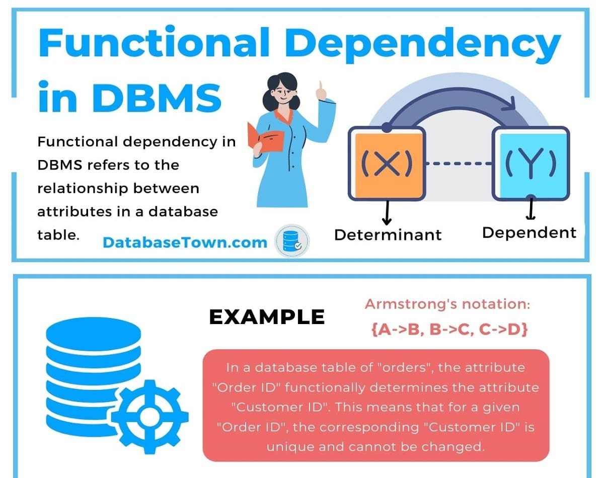

**My Journey Through Normalization, Temporal Data, and Database Design Alchemy 🧙♂️📊**  
This unit transformed me from a database novice into a normalization ninja, mastering the art of eliminating redundancies and modeling time-sensitive data. Let's dive into the magic of functional dependencies, the elegance of normal forms, and the wisdom of atomic domains.  

---

### **TAKE AWAYS FROM THE UNIT**  
This unit was more than just memorizing rules—it was about **thinking critically** about database design, **balancing theory and practice**, and learning how to make databases **efficient and reliable**.  

---

### **My Learning and Its Importance 🧠💡**  

#### **1. Functional Dependencies: The DNA of Database Design** 
 

**What I Learned:**  
Functional dependencies (FDs) are the backbone of normalization. They describe relationships between attributes, like `ID → name, salary`, meaning ID uniquely determines name and salary.  

**Why This Is Important:**  
FDs help identify redundancies and anomalies. Without understanding them, databases become bloated and inconsistent—like a library where the same book is stored in 10 places!  

**Funny Thought:**  
Functional dependencies are like strict parents: "If I know your ID, I know where you live!" 🏠🔍  

---

#### **2. Normal Forms: The Hierarchy of Database Purity**  

**What I Learned:**  
- **1NF**: All attributes must be atomic (no lists or composites).  
- **2NF**: No partial dependencies on a composite key.  
- **3NF**: No transitive dependencies.  
- **BCNF**: Every determinant is a superkey.  
- **4NF**: No multivalued dependencies unless the determinant is a superkey.  

**Why This Matters:**  
Each normal form eliminates a specific type of redundancy. Ignoring them leads to update anomalies—like changing an address in one place but not another.  

**Funny Thought:**  
Normalization is like decluttering your room, but for data. "Why do I have 5 copies of the same invoice?!" 🧹🗄️  

---

#### **3. Multivalued Dependencies: When One ID Isn’t Enough**  

**Takeaways:**  
Multivalued dependencies (MVDs) occur when an attribute independently determines multiple values. For example, an instructor with multiple addresses and departments.  

**A Note on Its Importance:**  
MVDs lead to 4NF, where we decompose tables to avoid repeating data. No more listing the same address for every department!  

**An Amusing Thought:**  
MVDs are like a chef who works at two restaurants—you don’t need to list their home address on both menus! 🍳🏠  

---

#### **4. Temporal Data: Time-Traveling Databases**  
**What I Learned:**  
Temporal data tracks changes over time, like course titles or instructor addresses. We add `start_date` and `end_date` to tuples to model validity periods.  

***Why It Matters***  
Without temporal modeling, history is lost. Imagine not knowing when a course title changed—chaos!  

**Funny Thought:**  
Temporal databases are like time machines: "On January 1, 2023, this course was called 'Database Magic'..." ⏳✨  

---

#### **5. Atomic Domains: The Indivisible Atoms of Data**  
**What I Learned:**  
1NF requires atomic values—no composites or multi-valued attributes. For example, split "address" into `street`, `city`, and `state`.  

**Why It Matters:**  
Non-atomic values lead to messy queries. Searching for "New York" in a combined "address" field is like finding a needle in a haystack.  

**Funny Thought:**  
Atomic domains are like LEGO blocks—you can’t use a pre-built castle; you must assemble it brick by brick! 🧱🏰  

---

### **Self-growth and Reflection 🌱💭**  
**Pre-knowledge struggles:**  
- Normal forms sounded like a cult: "Join us in the Third Normal Form!"  
- I once designed a table with a "phone_numbers" list and wondered why queries failed.  
- Temporal data made my head spin—like trying to solve a Rubik’s Cube in 4D.  

**Challenges:**  
- **BCNF Decomposition**: Accidentally split a table into oblivion.  
- **Temporal Queries**: Wrote a query that returned 10 years of data instead of one day.  
- **Atomicity**: Tried storing JSON in a column and learned the hard way why 1NF exists.  

---

### **Tasks Done in Class**  
1. **Normalization Lab**: Decomposed a messy "in_dep" table into BCNF.  
2. **Temporal Data Exercise**: Modeled course history with `start_date` and `end_date`.  
3. **Atomic Domains Demo**: Split "address" into atomic attributes and celebrated the cleaner queries.  
4. **4NF Puzzle**: Fixed a schema where instructors had repeating addresses per department.  

---

### **UNIT END Thoughts**  
This unit armed me with the tools to design databases that are efficient, scalable, and anomaly-free. Next stop: conquering distributed systems and NoSQL!  

**Funny Closing:**  
If databases were superheroes, normalization would be the disciplined mentor, temporal data the time traveler, and atomic domains the strict but fair judge. 🦸🗄️  

---  