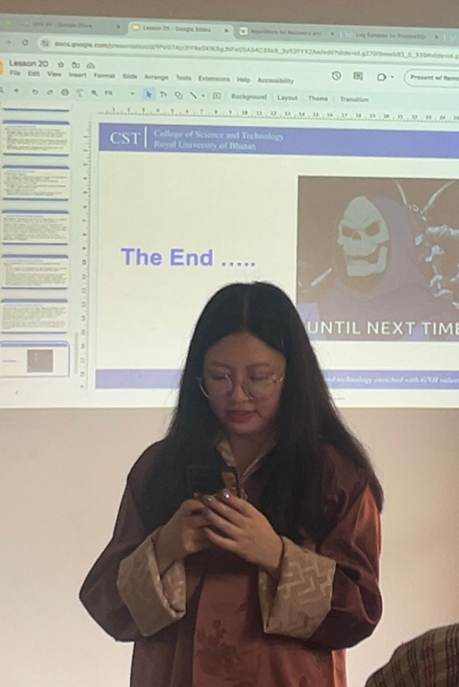

**A Very Special Thank You for DBS101: The Journey of a Lifetime 🎓✨** 

I  feel grateful because this module was more than the learning of SQL. It was about **personal development, working in teams, and celebrating discovery**.

### **To Our Amazing Tutor : Miss Palden ❤️🧑‍🏫**  

Thank you for being more of a guide and less of an instructor. Your enthusiasm for everything database related was infectious, and then there was that patience for those challenging concepts (I'm looking at you, BCNF and deadlocks) to make them feel really approachable. You did not just teach us the theory but opened our eyes to how databases influence the real world, from banking to social networks.  

You also went the extra mile for us, including but not limited to:  
- Hands-on practicals that made us internalize the concepts, rather than just accepting the theories that went with them.  
- Patience through every single "what-if" question we threw at you (yes, even the ridiculous ones!).  
- Urging us to think critically rather than just go through the motions of memorizing.  
- Our infamous "candy tax" rule turned latecomers into class heroes bearing sweet bribes was the most interesting part of our class and i remember how we rush to the class before the reporting time miss asked us to come. we have had enough candy for the semester la 🍫😏.

This module would never have been the same without you. **Thank you for making databases exciting!**

### **To My Wonderful Classmates 👥**  
Teamwork makes learning way more fun. You made this never-to-forget journey-it ranged from **group projects**  to **late-night study sessions before Practical submissions, Assignment submissions and exam days**. Whether it was:  
- Sharing **mnemonics about ACID property** ("Atomic Cats Isolate Dogs"?).  
- Perry-ing wins, like writing a perfect transaction on the first try.  
- That funny time after we joked about our own mistakes and said, "Who ever thought a semicolon was all that?"  

You turned classes into a community. **Thanks for the camaraderie, support, and memories.**   

### **A Semester to Remember 🌟**  
As I close this chapter, I’m leaving with:  
✔ **Skills** to design bulletproof databases.  
✔ **Confidence** to tackle real-world data challenges.  
✔ **Friendships** forged in the fire of GROUP BY and HAVING clauses.  

Thank you all for making DBS101 so special! For all the queries we wrote together, the deadlocks we stayed up all night dealing with, and the databases we're going to build in the future!

**Signing off with a COMMIT; and a smile,**  
Namgay Lhamo
---

**P.S.** Remember: In life as in databases, when you deadlock , just rollback, tune your indexes, and try again! 💪🔁