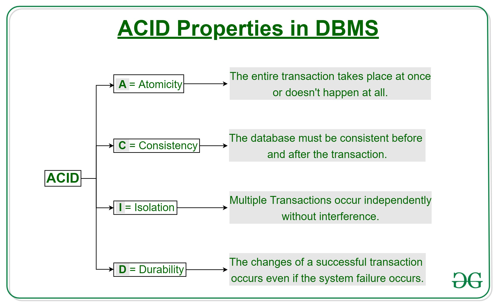

**Mastering Recovery Mechanisms, Concurrency Control, and Transaction Magic 🧙‍♂️🔗**  
This unit transformed me from a database enthusiast into a wizard of recovery systems and concurrency control, mastering the art of ensuring data integrity and seamless transaction handling. So, let's get the atomicity magic going, lock things in, and apply the wisdom of recovery algorithms.  

---

### **POINTS OF INTEREST FROM THE UNIT**  
This unit was beyond just understanding the concepts of databases, it was about **critical thinking** on database systems' resilience, **balancing performance and safety**, and ensuring databases remain **consistent and available when failures occur**.

---
### **My Learning and Its Importance 🧠💡**  

#### **1. Recovery Mechanisms: The Safety Net of Databases**  

**What I Learned:**  
Certain recovery mechanisms ensure that databases can survive failures like crashes, human errors, and hardware failures. These techniques, including log based recovery and checkpoints, help restore databases to a consistent state.  

**Why This Is Important:**  
Without recovery systems, a simple failure might wipe away really important data forever imagine a library catching fire with never a duplicate copy of any document!  

**Funny Thought:**  
Recovery mechanisms are the time traveling superheroes. "Oops, system crash, rewind, and let's pretend it never happened!" ⏳🦸  

---

#### **2. ACID Properties: The Pillars of Transaction Reliability**  

**What I Learned:**  
- **Atomicity:** Transactions are all or nothing.  
- **Consistency:** Transactions transform the database from one valid state to another.  
- **Isolation:** Transactions that occur concurrently don't impact each other.  
- **Durability:** Once committed, the changes are permanent.  

**Why This Matters:**  
In short, an ACID transaction is a guarantee to the user that their transaction is reliable. To ignore these properties is as good as building your house on sand: in the end, it will crumble.  

**Funny Thought:**  
ACID is the database's immune system: "No dirty reads allowed! Isolation is our middle name!" 🛡️💊
---
#### **3. Concurrence Control: Keeping Transactions in Line** 
  

**Takeaways:**  
- **Locks**: Shared (read) or exclusive (write) locks prevent conflicts.  
- **Two-Phase Locking (2PL):** All locks are acquired first and then released.  
- **Deadlocks:** Cycles in which transactions wait forever; deadlocks can be solved either by detection or prevention.  

**Importance:**  
Without concurrency control, transactions would step on the toes of one another like two chefs fighting over the same knife!  

**Funny Thought:**  
Deadlocks are stubborn roommates: "You go first!" "No, you go first!"  

---

#### **4. Log-Based Recovery: The Database Diary**  

What I Learned: Logs record every change (old and new values) before being applied. Undo commands will reverse incomplete transactions, and redo commands will reinstate committed ones.

**Why It Matters:**  
The log is the memory of a database. Without a log, even recovery becomes a guessing game like trying to restore a deleted file without a recycle bin!  

**Funny Thought:**  
Logs are like a detective's booth: "On Tuesday at 3 PM, transaction T1 subtracted NU.50 from account A..." 

---

#### **5. Checkpoint: The Database Save Point**  

What I Learned: The checkpoint saves the database state periodically and reduces the effort of recovery. Fuzzy checkpoints allow transactions to continue during the saving process.  

**Why It Matters:**  
Without checkpoints, recovery would just go near the entire log—like finding a typo after reading through a thousand-page book!

**Funny Thought:**  
Checkpoints are like napping in the middle of a marathon: "Phew, now I only need to run from here!" 🏃‍♂️💤  

---

### **Self Growth and Reflection 🌱💭**  
**Pre-knowledge struggles:**  
- I thought recovery meant "restart m'server and pray."  
- Deadlocks seemed like mythical creatures-until I managed to create one in lab.  
- Grew up thinking logs were just gobbledygook until I learned to read them like a story.  

**Challenges:**  
- **2PL Implementation:** Locks released prematurely, disturbing the order of commitment.  
- **Deadlock Handling:** Wrote a transaction that starved others like a hog in the database.  
- **Checkpoint Timing:** Being overly aggressive with checkpoints actually ate into system performance.  

---

### **UNIT END Thoughts**  
This unit.'Imparted tools, which would help me in designing robust and fair-performance databases, accommodating failure and concurrency.'Now comes Distributed Databases and Advanced Replication.'  

**Closing ~Ironic:**  
Imagine a circus with recovery mechanisms as safety nets, concurrency control being the ringmaster, and ACID properties as the tightrope walker's balance pole. 🎪🤹  

---
