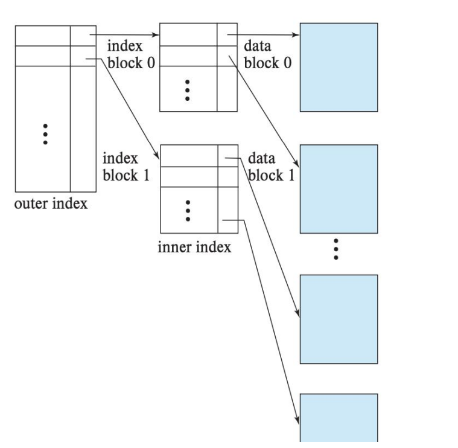

**My Journey Through Indexing, Query Processing, and Optimization 🚀💾**  
Databases are at the heart of any modern application, and knowing how to efficiently retrieve and process data is paramount. This unit ushered me into the world of indexing, query processing, and optimization, from a greenhorn who now confidently parses some heavy database operations. Let's get into the crux of my learning!  

---

### **KEY TAKEAWAYS FROM THE UNIT**  
This unit was never just about memorizing commands; it was about grasping the *how* and *why* behind database operations concerning performance. From index strategies to cost-based optimization, everything counted in making the database perform with speed and efficiency.

---
### **My Learning and Its Importance 🧠💡**  

#### **1. Indexing: The Speedsters of Databases**  

**What I Learned:**  
- **Ordered Indexes:** Sorted structures such as B-trees and B+ trees enable range queries. 
 

- **Hashed Indexes:** Use of hash functions for equality searches.  

- **Dense Indexes Vs. Sparse Indexes:** Trade-off between space and speed. 
 

- **Multilevel Indexes:** Creating an index on another index to reduce disk I/O.  

**Why It Matters:**  
Once there were no indexes, simple queries would scan entire tables, thus reducing the performance. Indexes are the Table of Contents in a book; they help fast find something.  

**Side Thought:**  
If a database were a library, indexes would be the librarians who know where exactly every book is kept, and full-table scans would be you lost in the stacks. 📚🔍 

---
#### **2. Query Processing: From SQL to Execution Plans**  

**What I Learned:**  
- **Parsing and Translation:** Turning these SQL queries into relational algebra expressions.  
- **Choose Evaluation Plans:** Annotate operations with algorithms (e.g., nested-loop join, hash join).  
- **Pipelining vs. Materialization:** Decision based on memory usage vs execution speed.  

**Why It Matters:**  
Query processing is important because it determines how the data is fetched from the databases; if optimized, responses will be very fast and less resource-consuming.  

**Funny Thought:**  
Query processing is like cooking: parsing is reading the recipe, evaluation is chopping vegetables, optimization is coming up with a way to prepare the dish really quickly before the house burns down. 🍳🔥  

---
#### **3. Query Optimization: The Art of Efficiency**  

**What I Learned:** 
- **Equivalence Rules:** Or... transformations of the queries into more efficient representations (e.g., pushing selections down).  
- **Execution Order:** Joining in ways that minimize intermediate result size.  
- **Cost-Based Optimization:** Estimating costs with statistics or using sampling and choosing plans with the least cost.  

**Why It Is Important:**  
Optimization ensures that databases support complex queries in an efficient manner within a reasonable time.  

**Funny Thought:**  
The query optimizer is like a GPS system. It evaluates all routes (plans) and selects the one with the least traffic (cost). 🗺️🚗  

---
#### **4. B-Trees and B+ Trees: The Guardians of Ordered Data**  

**What I Learned:**  
- **B-Tree Properties:** Self-balancing trees with more than one key in each node.  
- **B+ Tree Advantage:** Since all the data is in the leaves, it is good for range queries.  
- **Searching in B+ Trees:** With logarithmic time complexity, searching is very efficient on B+ trees.  

**Why It Is Important:**  
They are real indexing systems allowing quick searches through huge data volumes.  

**Funny Thought:**  
Someone once said that B+ trees are like carefully labeled filing cabinets. You never end up digging through the wrong drawer trying to find something. 📁✨  

---
#### **5. Hash Indices: The Speedy Lookup Specialists**  

**What I Learned:**  
- **Buckets:** Keys access buckets by hash function.  
- **Static Hashing VS Dynamic Hashing:** Setting a predefined limit for your buckets or allowing them to grow dynamically has trade-offs.  
- **Limitations:** Does not provide any means to perform range queries.  

**Why It Matters:**  
Hash indices are very good at conducting equality searches and thus work well for primary key lookups.  

**Funny Thought:**  
Hash indices are like party bouncers: name-check if your key is on the list, and you either make it in or get tossed in an instant. 🎉🚪  

---

### **Personalities That Shaped Me & Reflections 🌱💭**  
**Things Before I Knew:**  
I believed indexes were just "taxes" that database systems charged. Now I know indexes are a very powerful means of making things fast. Complex queries intimidated me, breaking them down into steps helped me. 

**Wins:**  
- Implemented and experimented on the dense and sparse indexes on the sample database.  
- Rewrote a nested subquery into joins for improved performance.  
- Understood how B+ trees reduce disk I/O in searching.  

**Challenges:**  
- **Join Ordering:** It was hard figuring out the best way of doing multiple joins on tables.  
- **Cost Estimation:** Taking statistics and interpreting them for optimization was challenging.  
- **NULL Handling:** I would forget to say `IS NULL` in my queries which would cause me some sorrow with unexpected results.  

---
### **Tasks Done in Class**  

---

### **UNIT END Thoughts**  
This unit demystified how databases work under the hood, from indexing strategies to query optimization. The next step? Applying these concepts to real-world systems and tuning them for peak performance.  

**Funny Closing:**  
If databases were superheroes, indexes would be their super-speed, query optimizers their strategic minds, and B+ trees their unshakable balance. Together, they keep the data universe running smoothly! 🦸‍♂️💾  

---
